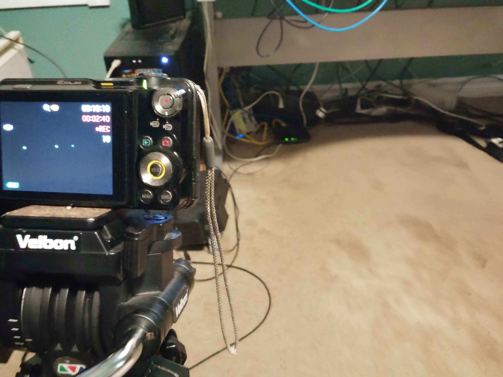
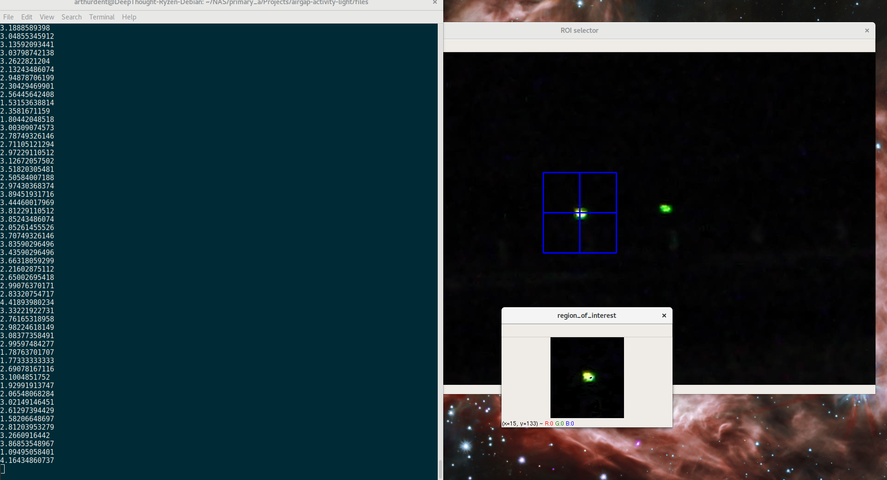
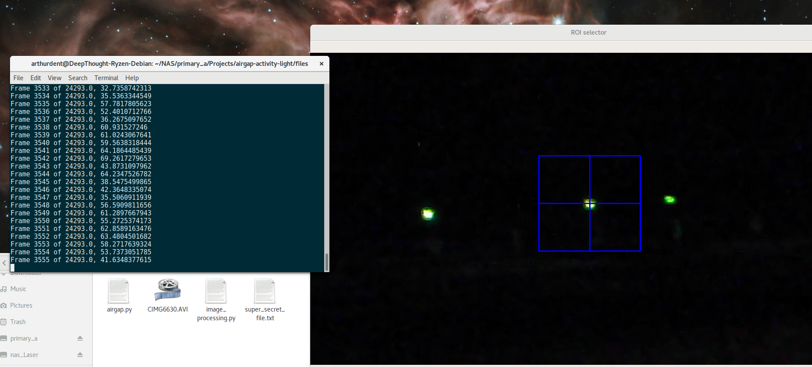
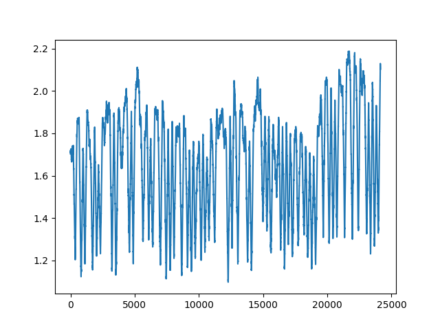
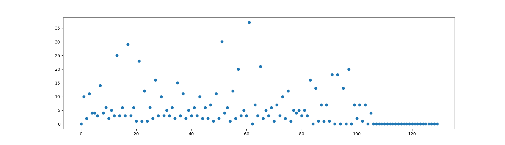

Last week at SimCoLab, whilst distracting Regan from important networking stuffs, I idly speculated on the possibility of transferring data 
entirely through the indicator leds of a piece of networking equipment.

I got a little nerd-sniped, which is terrible when you're incredibly busy. I carved out a little bit of time to put together a barely-functional demo.

### Use this only for good.
#### It's inconcievable for this to be useful for nefarious purposes anyhow.
#### And even if a suitable situation arose, you shouldn't use this, since it's crap.

So here's the hypothetical situation:

Some secret, air-gapped datacenter has an IP camera of questionable security with an ethernet jack, a router, a switch, a drive indicator light, or really
any piece of paraphenalia with a light on it within the field of view. Someone drops a USB drive outside - a la stuxnet - and a script just breaks up a file into bytes, tries to find the default gateway, and yells at the router
at predetermined intervals. 

Then, using OpenCV, the recording of the scene is cropped, filtered based on the light's color, averaged, thresholded, and binarized.

The achievable throughput seems to be around 0.2 bps.

The setup (sorry Regan, my wires are a mess):

The final binary graph, where I gave up:

Some problems with this approach:

* Low channel efficiency when network isn't idle

And now I'm out of time.

